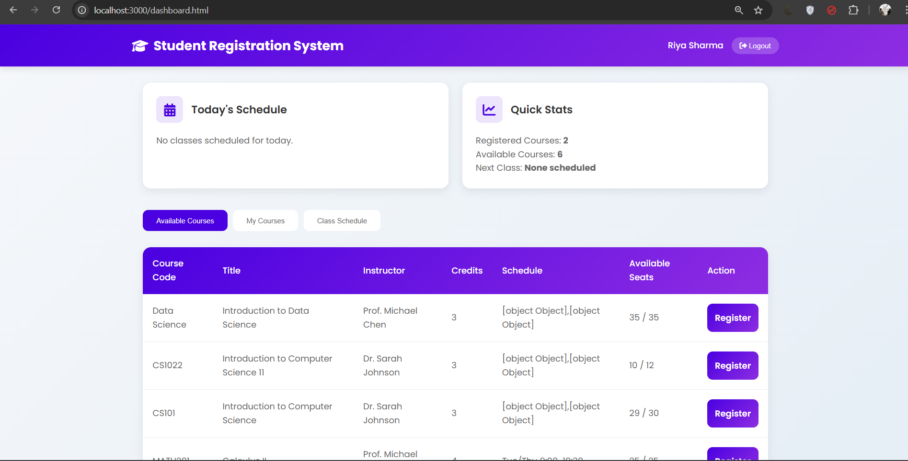

# Student Course Registration System

A full-stack **Student Course Registration System** developed as part of my **Internship Project**.  
This web application allows students to register for courses and enables administrators to manage users, courses, and registrations through a secure role-based system.

## 📸 Screenshots

### Home Page


### Student dashboard Page


### Admin Dashboard Page


---

## Project Description

The Student Course Registration System is a database-driven web application built using **Node.js, Express.js, MySQL, and JWT authentication**.  
It provides a smooth interface for students to explore and register for courses while allowing administrators to manage the entire system efficiently.

This project demonstrates real-world backend development concepts including authentication, authorization, REST APIs, database relationships, and triggers.

---

## Features

### Student Module
- Student registration and login
- View available courses
- Register for courses
- Drop registered courses
- View registered courses
- View personal class schedule

### Admin Module
- Secure admin login
- Admin dashboard with statistics
- Manage users (add, update, delete)
- Manage courses (add, update, delete)
- View all registrations (registered & dropped)
- Update registration status

---

## Technologies Used

### Backend
- Node.js
- Express.js
- MySQL (MariaDB)
- JWT (JSON Web Token)
- bcryptjs

### Frontend
- HTML5
- CSS3
- JavaScript
- Font Awesome
- Google Fonts

### Tools
- Git & GitHub
- Postman
- phpMyAdmin
- VS Code

---

## Project Structure

```

COURSE-APP/
│
├── config/
│   └── database.js
│
├── database/
│   └── course_registration.sql
│
├── public/
│   ├── css/
│   │   └── style.css
│   ├── js/
│   │   ├── auth.js
│   │   ├── admin.js
│   │   └── dashboard.js
│   ├── index.html
│   ├── login.html
│   ├── register.html
│   ├── dashboard.html
│   ├── admin.html
│   └── admin_dashboard.html
│
├── routes/
│   ├── auth.js
│   ├── courses.js
│   └── registrations.js
│
├── .env
├── package.json
├── server.js
└── README.md

````

---

## Database Design

The application uses a **MySQL database** with the following tables:

- `users` – stores student and admin details
- `courses` – stores course information
- `registrations` – manages course registrations
- `class_schedule` – manages course schedules

### Database Triggers
Triggers automatically update the `current_students` count when:
- A student registers for a course
- A student drops a course

The complete SQL schema is included in `database/course_registration.sql` :contentReference[oaicite:0]{index=0}.

---

## Environment Variables

Create a `.env` file in the root directory:

```env
DB_HOST=localhost
DB_USER=root
DB_PASSWORD=
DB_NAME=course_registration
SESSION_SECRET=course-registration-secret-key
PORT=3000
````

---

## ▶ How to Run the Project

### 1️ Clone the Repository

```bash
git clone https://github.com/your-username/course-app.git
cd course-app
```

### 2️ Install Dependencies

```bash
npm install
```

### 3️ Setup Database

* Open **phpMyAdmin**
* Create a database named `course_registration`
* Import `database/course_registration.sql`

### 4️ Start the Server

```bash
npm start
```

or for development:

```bash
npm run dev
```

Server will run at:

```
http://localhost:3000
```

---

## 🔐 Authentication & Security

* Passwords are encrypted using **bcrypt**
* JWT-based authentication
* Role-based authorization (Student / Admin)
* Protected API routes using middleware

---

## 📡 API Overview

| Method | Endpoint             | Description          |
| ------ | -------------------- | -------------------- |
| POST   | `/api/register`      | Student registration |
| POST   | `/api/login`         | Login                |
| GET    | `/api/courses`       | View all courses     |
| POST   | `/api/registrations` | Register for course  |
| GET    | `/api/admin/users`   | View users (Admin)   |
| POST   | `/api/admin/courses` | Add course (Admin)   |

---

## 📚 Learning Outcomes

* RESTful API development
* JWT authentication & authorization
* Secure password hashing
* MySQL relationships & triggers
* Backend project structuring
* Real-world CRUD operations

---

## Developed By

**Girisaa Priyadharsini M**
Internship Project – 2025

---

## 📄 License

This project is developed for **educational and internship purposes only**.

```

